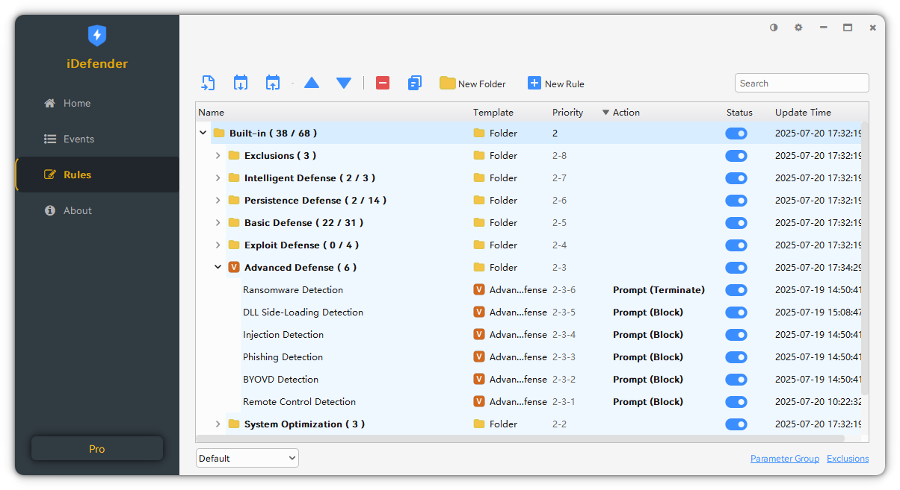
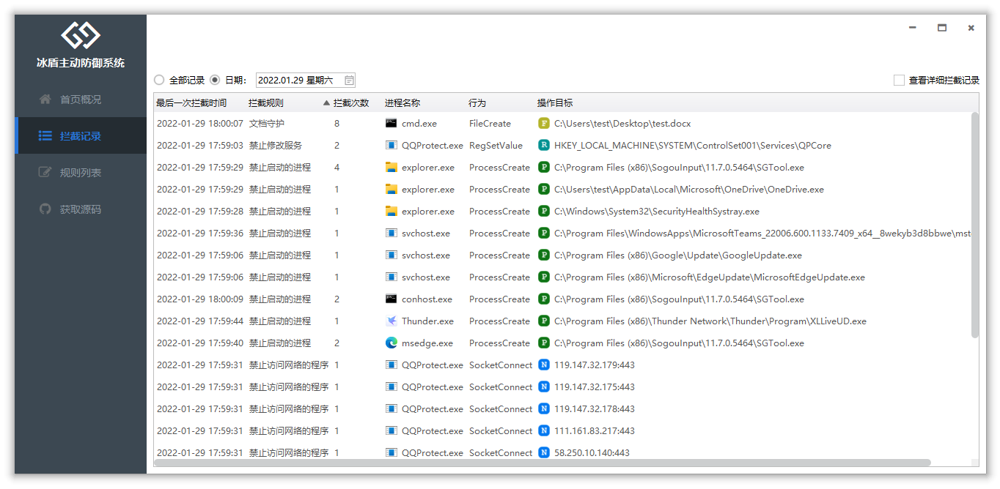
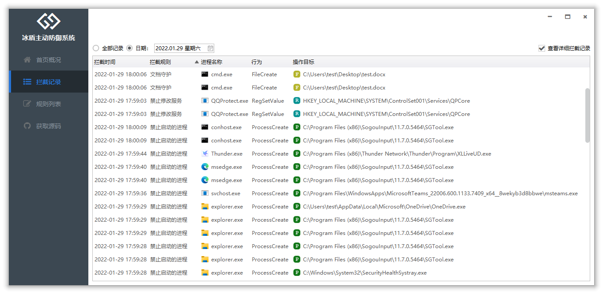

## iDefender

**冰盾 - 终端主动防御系统**  【专业不流氓】是一款基于[iMonitorSDK](https://imonitorsdk.com/)实现，为专业人士打造的终端、主机**开源**主动防御系统。可以保护您的电脑免受恶意软件、流氓软件、勒索病毒等的威胁。

## 功能介绍

冰盾是基于规则驱动的软件，用户可以根据规则实现任意的防护功能。未来还可以通过规则市场，一键获取丰富的拦截规则。

对于企业用户，如果您希望对企业内部所有终端统一下发、更新规则，可以试用：**[冰云 - 终端一体化管理平台](https://imonitorsdk.com/icms)**

## 软件截图

**默认的规则以及截图的拦截记录只是用于功能演示，不代表被拦截的属于恶意或者流氓的行为，如果侵犯到您的权益，请邮件联系，会马上更新去掉相应的规则及拦截功能演示。**

