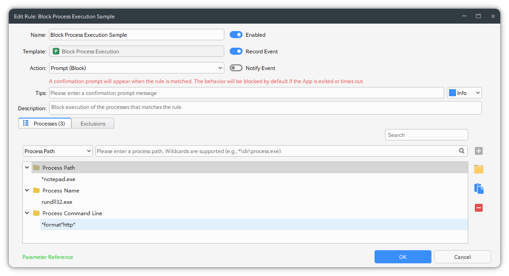
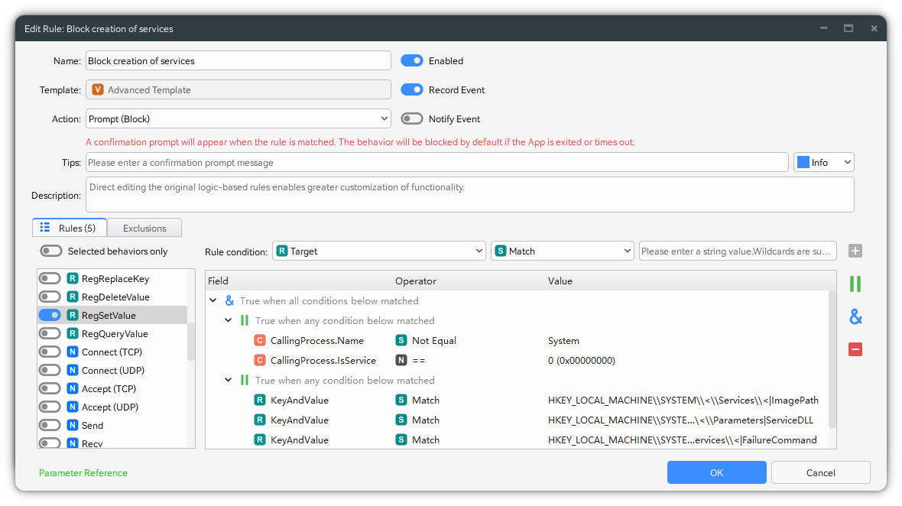
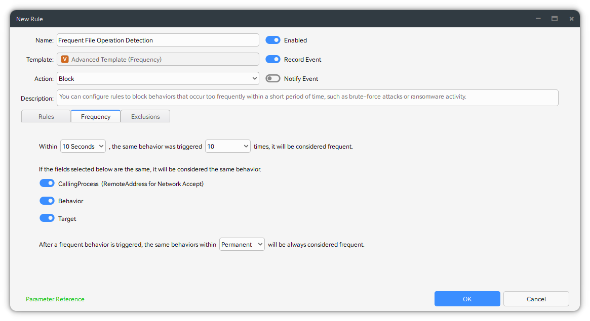
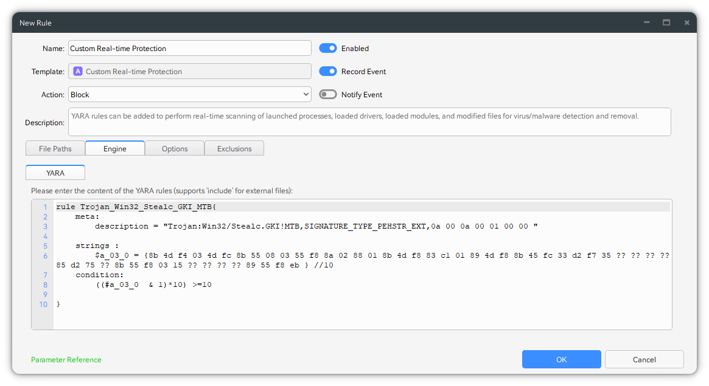
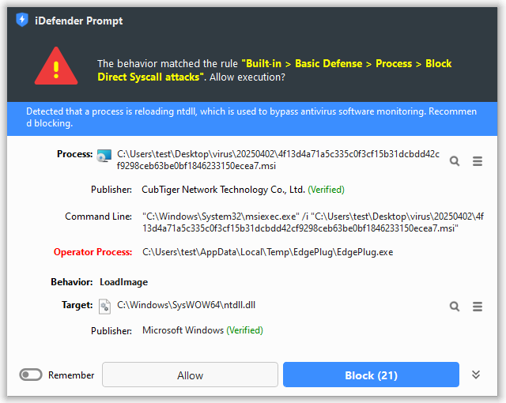
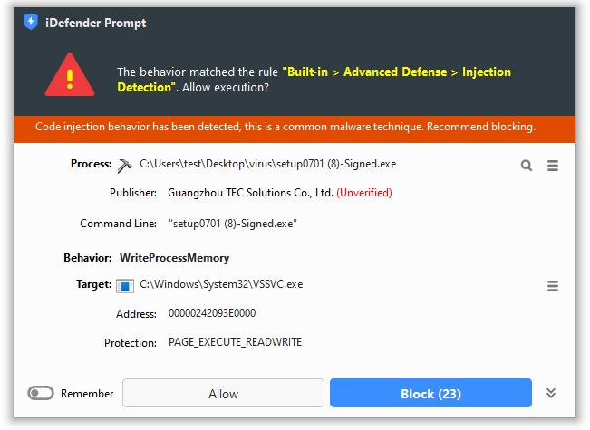
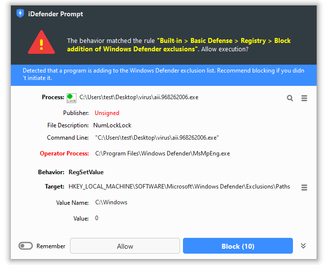
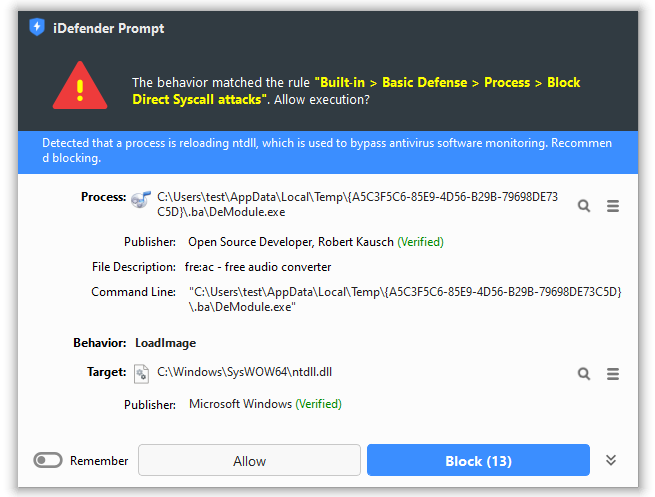
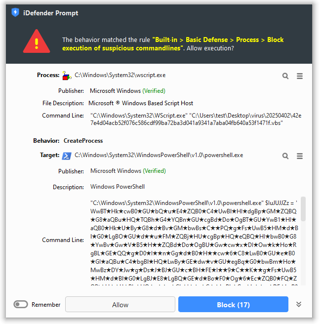
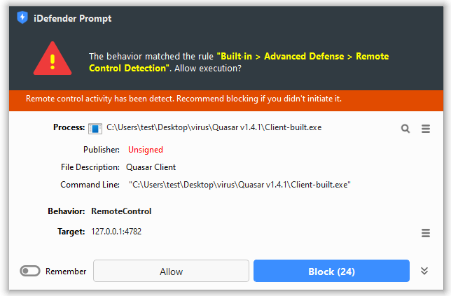

## Introduction

**iDefender** - The Infinite Potential Host Intrusion Prevention System (HIPS) & Real-time Endpoint Detection and Response for Home

- **Prevent Ransomware**

  Detect and block ransomware in real time to protect critical files from malicious encryption.

- **Defend Advanced Threats**

  Proactively blocks advanced persistent threats (APTs), including sophisticated attack vectors like shellcode injection, DLL side-loading, and remote control.

- **Block Exploits**

  Blocks exploitation attempts targeting document vulnerabilities and file-less attack vectors.

- **Hardening System**

  Hardens the operating system and application environment by controlling persistence mechanisms and other high-risk behaviors, effectively minimizing attack surfaces.

- **Secure Privacy**

  Safeguard user privacy and sensitive data by hiding critical files or intercepting unauthorized access attempts, providing multi-layered protection against data leaks.

- **Boost Productivity**

  Block unnecessary processes and services at launch to prevent resource waste and maintain endpoint performance.

## Screenshots

## Download

Website: https://idefender.net

中文官网: https://trustsing.com/idefender
