> For more language support, please refer to the language directory.

## iDefender

**冰盾 · 主动防御系统**  【专业不流氓】是一款基于[iMonitorSDK](https://imonitorsdk.com/)实现，为专业人士打造的终端、主机主动防御系统。使用冰盾可以帮助您拦截漏洞攻击、抵制流氓软件、保护电脑安全、提高工作效率。

软件下载请移步：https://imonitorsdk.com/idefender

微信交流群：

## 功能特点

- 支持监控拦截多种事件，包括进程、文件、注册表、网络等。
- 内置智能防护、系统优化、安全加固、漏洞防御等默认规则，一键开启防护功能。
- 支持多种规则模板，可以快速添加规则，满足不同的防护需求。
- 占用系统资源低，兼容性好，适用于Win7到Win11以及Windows Server系统。

## 使用场景

- **文档保护：** 防止勒索病毒对您的重要文档进行加密，保护您的数据安全。
- **进程拦截：** 拦截流氓软件的恶意行为，保护您的计算机系统不受恶意软件的侵害。
- **主机安全：** 提供多层安全防护机制，保护服务器不受黑客攻击和恶意软件的入侵。
- **病毒拦截：** 通过云引擎自动拦截病毒，提供实时的病毒拦截和清除功能，保护您的计算机系统不受病毒和恶意软件的感染。
- **隐私保护：** 监控并防止流氓软件对您的个人隐私进行窃取和上传，保护您的数据不被非法获取和滥用。
- **联网控制：** 监控网络流量，防止个人信息泄露和网络攻击，保护您的个人隐私。
- **上网管理：** 通过对上网行为的管理和控制，保障您的网络安全，防止不良信息的侵害。
- **进程守护：** 防止恶意程序对进程进行注入和结束，保护系统稳定和安全。
- **隔离沙箱：** 可以创建沙箱让指定的进程运行在独立的隔离环境。

## 使用说明

冰盾是一款基于软件行为规则的防御引擎，规则主要包括基础规则和自定义规则两部分。

### 基础规则

- **智能防护：** 利用智能分析和识别恶意软件行为，提供实时防护机制，确保系统免受恶意软件侵害。
- **系统优化：** 拦截非必要的软件和联网行为，提高系统运行速度和稳定性，提供更优秀的用户体验。
- **安全加固：** 拦截系统存在漏洞的组件和常见入侵途径，增强系统安全性，避免遭受恶意软件攻击。
- **漏洞防御：** 根据已知漏洞入侵方式开发专门的防御规则，保障系统不受黑客攻击和恶意软件入侵。

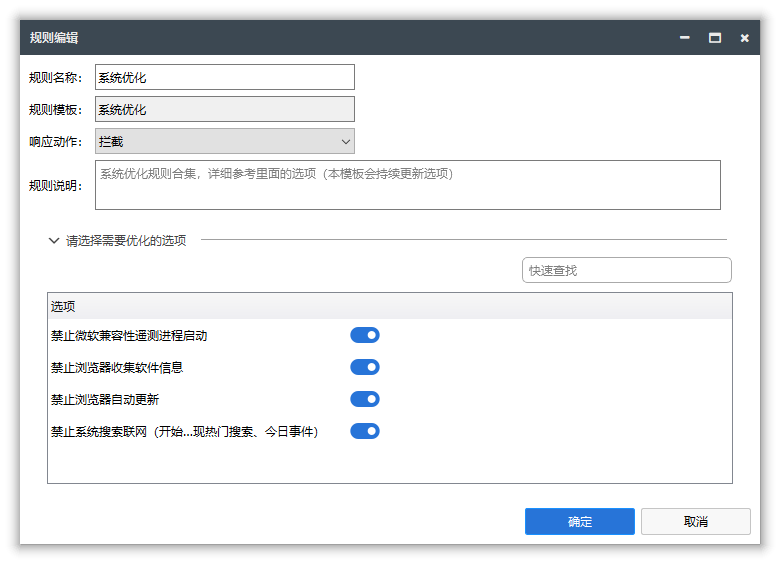

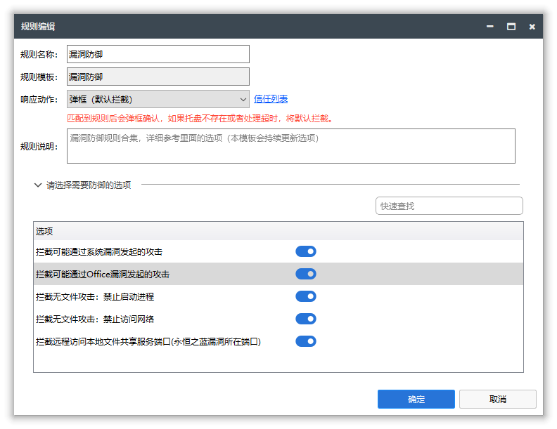

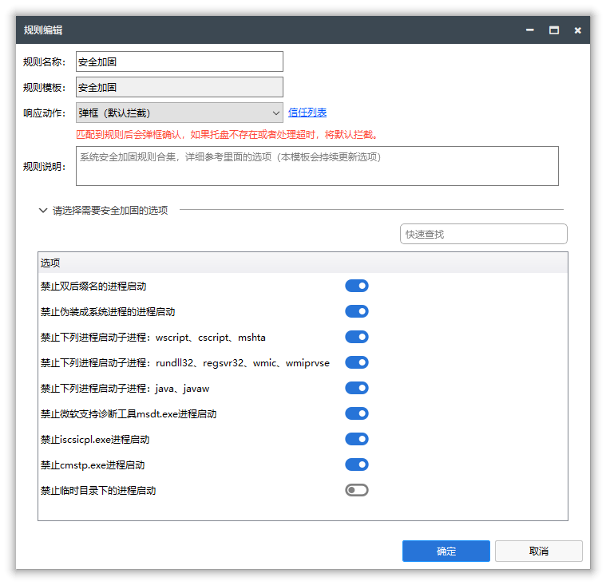

### 自定义规则

为了更方便地添加自定义规则，冰盾采用模板+参数的方式。使用模板创建规则后，只需添加关键参数即可建立规则。例如，使用进程启动模板时，只需填写需要拦截的进程名称或路径即可。

目前已经支持的规则模板有30多个，未来根据需求还会持续添加。

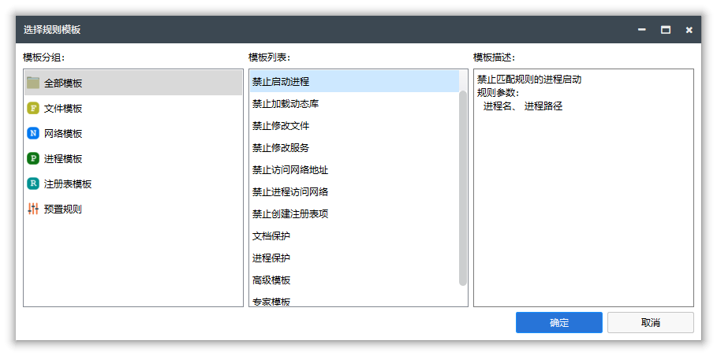

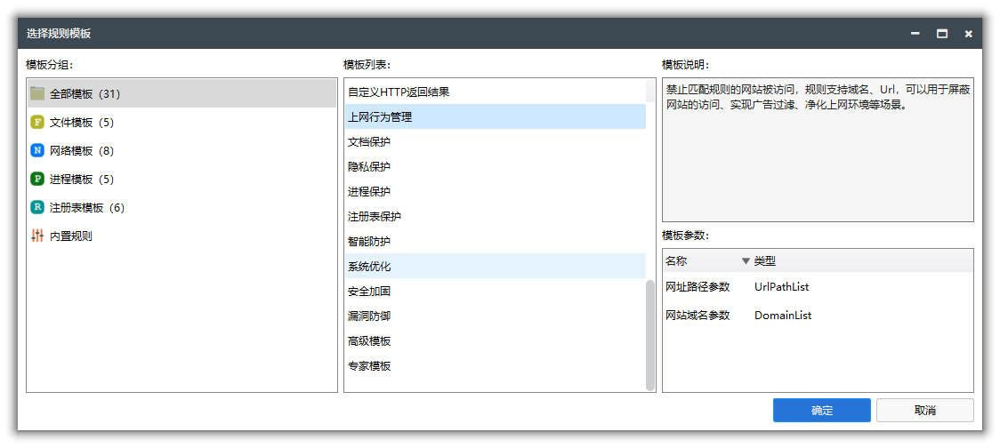

#### 常见规则模板介绍

##### 禁止进程启动

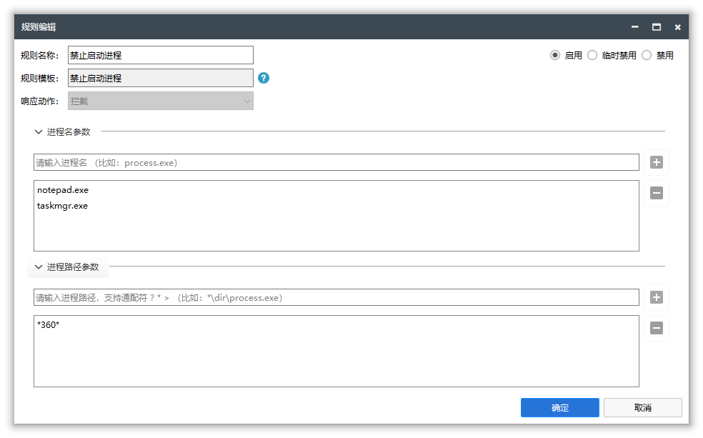

##### 文档保护

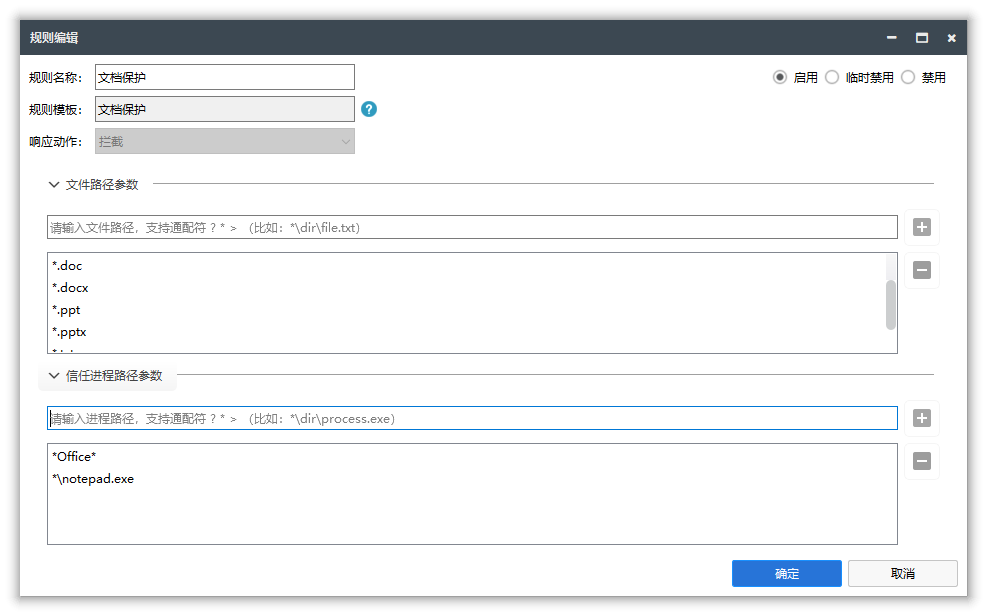

##### 隐私保护

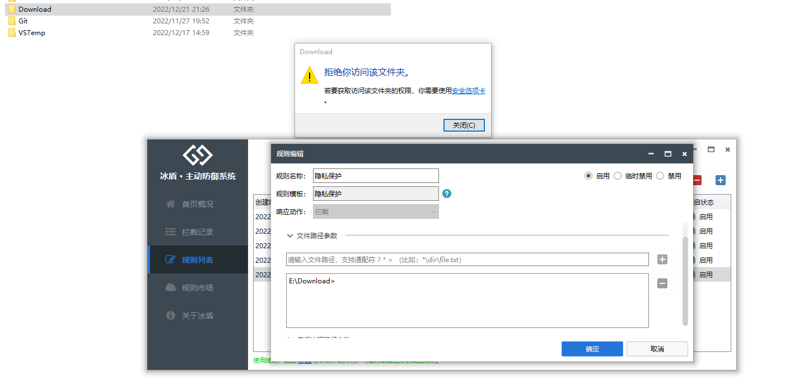

##### 禁止进程访问网络

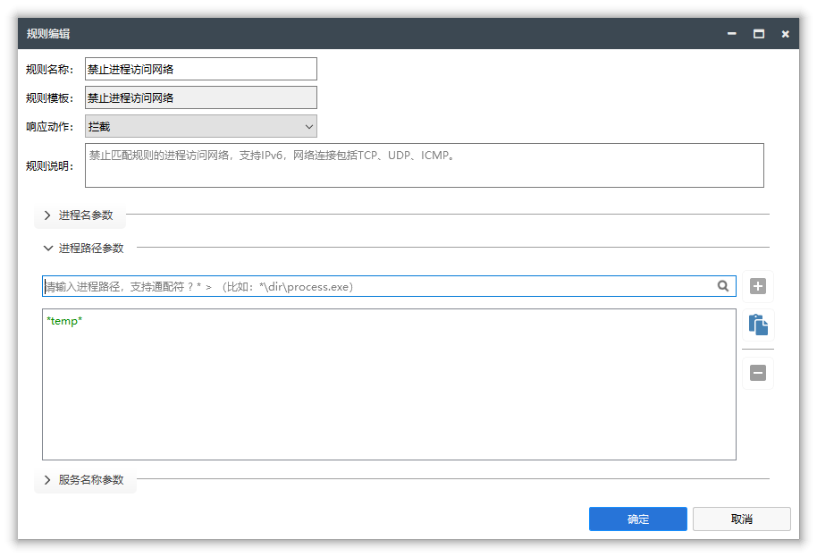

#### 专业版规则模板

除了上面的场景规则模板，专业版本还提供了更加专业化的规则模板：高级模板、专家模板。

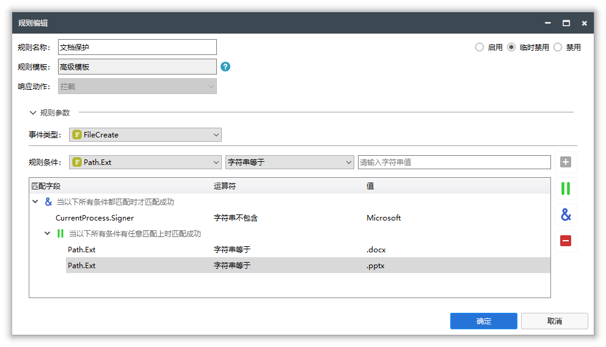

### 拦截响应

对行为拦截后，可以设置不同的响应动作：

- **拦截：** 默认动作，拦截行为的发生。
- **信任：** 信任当前的行为或者进程、配合优先级，可以实现白名单功能。
- **弹框（默认拦截）：** 拦截后弹框由用户确认具体的处理逻辑，如果没有响应则默认拦截行为发生。
- **弹框（默认信任）：** 拦截后弹框由用户确认具体的处理逻辑，如果没有响应则默认允许行为发生。
- **记录：** 只记录事件的发生，可以用于查看创建的进程或者全部的联网过程等。未来可以把记录的事件上报到第三方数据中心，实现EDR功能。
- **结束进程：** 结束当前的进程

## 软件截图

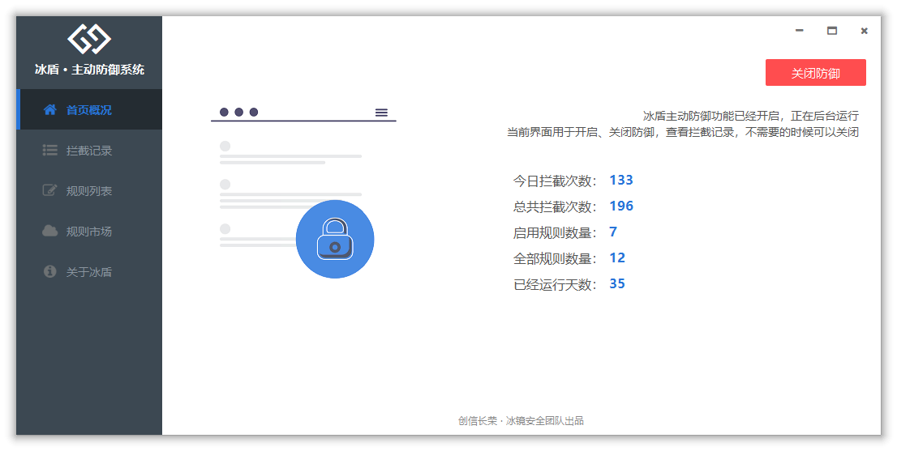

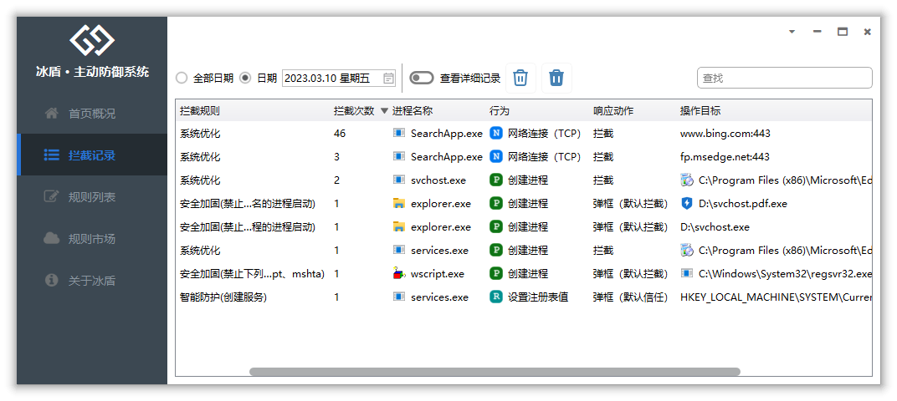

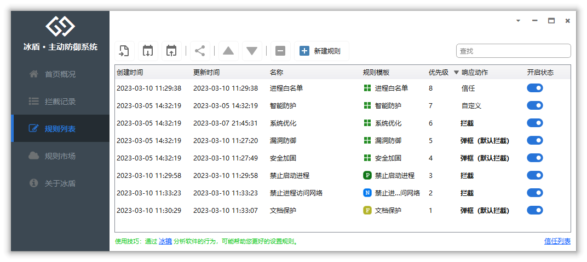

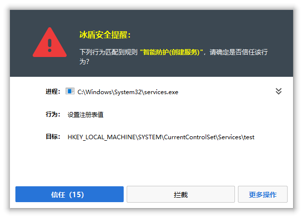

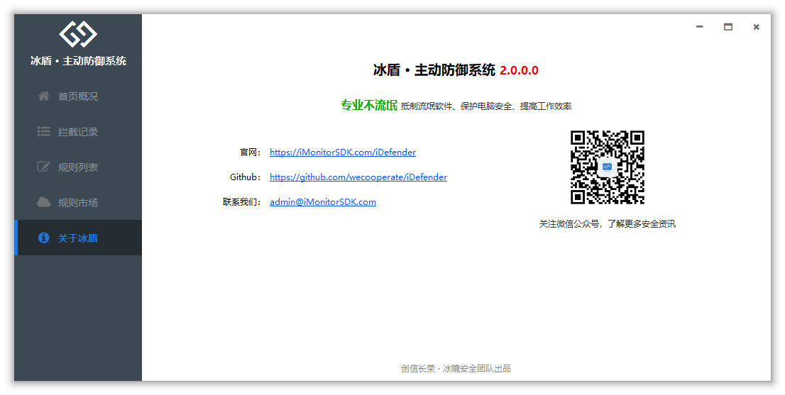

## 版本更新

请移步 https://imonitorsdk.com/idefender

