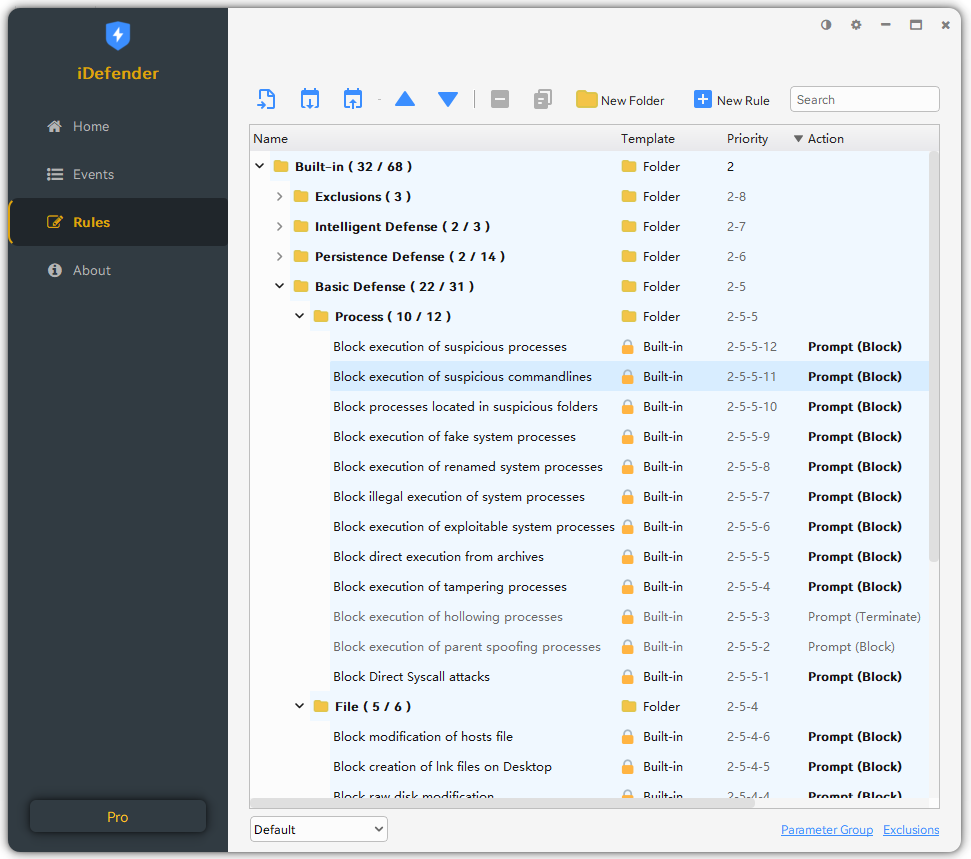

## Introduction

**iDefender** - The Infinite Potential Host Intrusion Prevention System (HIPS) & Real-time Endpoint Detection and Response for Home

- **Prevent Ransomware**

  Detect and block ransomware activities in real time to protect endpoint data and prevent malicious file encryption.

- **Defend Advanced Threats**

  Actively defends against advanced persistent threats (APT), especially attacks such as shellcode injection, DLL side-loading, and remote control.

- **Block Exploits**

  Intercept attacks exploiting document vulnerabilities or other popular file-less attacks.

- **Hardening System**

  Strengthen the operating system and application environment, reduce the attack surface, and enhance overall endpoint security.

- **Secure Privacy**

  Protect user privacy and sensitive data, preventing information leaks and unauthorized access.

- **Boost Productivity**

  Automate security protection to minimize security incident disruptions and improve endpoint performance and user experience.

## Screenshots

## Download

Website: https://idefender.net

中文官网: https://trustsing.com/idefender
